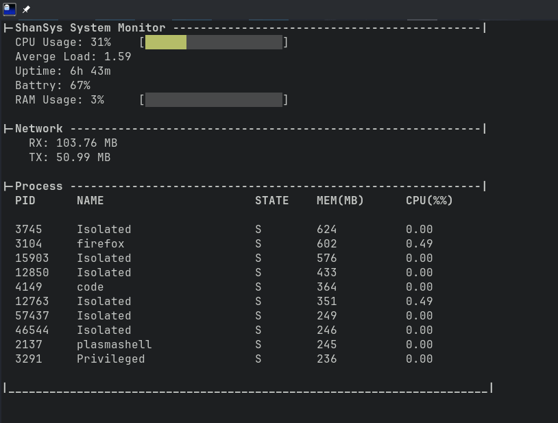

# ShanSys System Monitor

A terminal based system monitor written in C (╥﹏╥)



## Features 
- CPU usage and RAM with color bar
- Load avg, uptime and batter percentage
- Netowrking info
- Top 10 process by memory consumtion (also shown CPU % infront)
- Basic styling of terminal by ncurses

## Installtion 

Only runs on linux, ૮(•͈⌔•͈)ა

**Install Binary directly** 

[Dowdload for Linux](https://github.com/shantanuparte/ShanSys/releases/download/v1.0.0/main)

Change permission 
```
chmod +x main
``` 
And run the binary 
```
./main
```

### Build Through Code

First install ncurse

Fedora 

```
sudo dnf install gcc ncurses-devel
```

Debian
```
sudo apt install gcc libncurses-dev
```

Clone the repo ¯\\\_(ツ)\_/¯

```
git clone https://github.com/shantanuparte/ShanSys.git
```

Go to that directory
```
cd ShanSys
```

Compile 
```
gcc *.c -o shansys -lncursesw
```

Run 
```
./shansys
```

To stop 

```
Ctrl + C
```


## Project structure

| File | What it does |
| --- | --- |
| `main.c` | Main loop and retriving funcitons |
| `CPU.c / CPU.h` | Reads `/proc/stat` and calculates CPU usage |
| `ram.c / ram.h` | Reads RAM stats |
| `process.c / process.h` | for all porcess related things |
| `other.c / other.h` | Battery, load average, uptime, network and ncurses things |


## License

I am using the MIT License for this project (¬‿¬)

